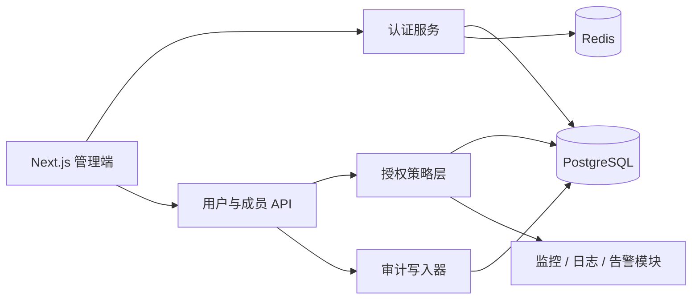
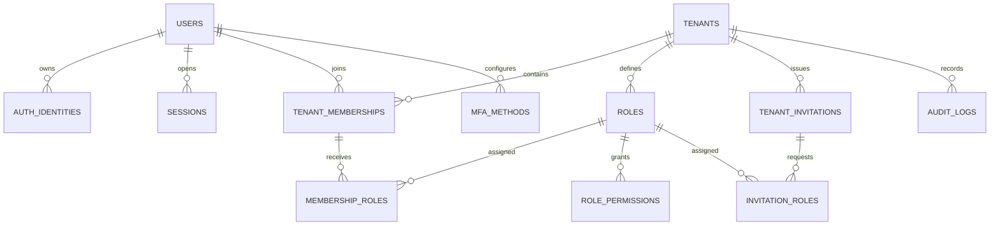

# Traceglow 用户模块设计

> 状态：Draft  
> 适用范围：Traceglow 多租户可观测平台管理端  
> 最后更新：2026-08-29

## 1. 目标

用户模块负责身份认证、租户成员管理和访问控制，不负责监控数据、告警规则、值班或账单本身。

首期需要支持：

- 邮箱密码注册、登录、退出和找回密码
- 邮箱验证与安全会话管理
- 一个用户加入多个租户，并在租户之间切换
- 创建租户、邀请成员、移除成员和转移所有权
- 预置角色和细粒度权限校验
- 用户资料、安全设置和审计日志
- 为后续 OIDC/SAML SSO、MFA、SCIM 和服务账号保留扩展边界

非目标：

- 首期不实现社交关系、公开个人主页和用户间私信
- 不将可观测数据权限直接编码在用户表中
- 不把 Redis 作为用户、成员关系或权限的唯一数据源
- 不允许前端提交的 `tenant_id`、角色名或权限声明直接成为可信授权依据

## 2. 核心概念

| 概念 | 定义 |
| --- | --- |
| User | 全局自然人账号，身份跨租户复用 |
| Tenant | 数据与权限隔离边界，界面统一称为“工作区” |
| Membership | User 与 Tenant 的关系，保存成员状态和加入信息 |
| Role | 租户内角色，可由多个权限组成 |
| Permission | 后端代码维护的稳定操作标识，例如 `member.invite` |
| Identity | 本地密码、OIDC、SAML 等外部登录身份与 User 的绑定 |
| Session | 一次已认证的设备会话，可单独撤销 |
| Service Account | 面向自动化和 API 的非自然人主体，不复用用户密码 |

命名约定：数据库和服务端使用 `tenant`，产品界面使用“工作区 / Workspace”。未来如需在一个客户组织下创建多个观测项目，应新增 `projects`，不要改变 `tenant` 的隔离语义。

## 3. 设计原则

1. 身份与授权分离：User 只回答“你是谁”，Membership 和 Role 回答“你在当前租户能做什么”。
2. 默认拒绝：没有明确权限、成员被暂停或租户被冻结时均拒绝访问。
3. 租户上下文来自服务端：从已验证会话与成员关系解析，不信任请求体中的租户信息。
4. PostgreSQL 是事实源：关键授权变更提交后立即以数据库结果为准。
5. 高风险操作可审计：邀请、角色变更、会话撤销、MFA 和所有权转移均写审计日志。
6. 凭证最小暴露：只保存哈希，不记录明文密码、令牌、恢复码和 API Key。
7. 删除可恢复且身份可追溯：用户先软删除并匿名化；审计记录按合规周期保留。

## 4. 模块边界



- 认证服务：校验凭证、签发和撤销会话、邮箱验证、密码重置。
- 用户服务：资料、租户、成员、邀请、角色和安全设置。
- 授权策略层：统一执行 `can(subject, permission, resource)`，业务模块不得自行拼接角色判断。
- 审计写入器：在同一数据库事务内记录高风险状态变更。
- 邮件适配器：发送验证、邀请和重置邮件；业务层只依赖接口。

## 5. 领域模型



### 5.1 主表

#### `users`

全局账号，不保存租户角色。

| 字段 | 类型 | 约束与说明 |
| --- | --- | --- |
| `id` | uuid | 主键，应用层生成 UUIDv7 |
| `email` | citext | 唯一、规范化，用于首期登录 |
| `display_name` | varchar(80) | 必填 |
| `avatar_url` | text | 可空，只保存对象存储地址 |
| `locale` | varchar(16) | 默认 `zh-CN` |
| `timezone` | varchar(64) | 默认 `Asia/Shanghai` |
| `status` | enum | `pending_verification/active/suspended/deleted` |
| `email_verified_at` | timestamptz | 可空 |
| `last_login_at` | timestamptz | 可空 |
| `created_at/updated_at/deleted_at` | timestamptz | 审计时间 |

索引：`unique(email) where deleted_at is null`。如果允许删除后重新注册，历史邮箱应先替换为不可逆匿名值。

#### `auth_identities`

支持一个用户绑定多个登录来源。

| 字段 | 类型 | 约束与说明 |
| --- | --- | --- |
| `id` | uuid | 主键 |
| `user_id` | uuid | 外键 `users.id` |
| `provider` | varchar(32) | `password/oidc/saml` |
| `provider_subject` | varchar(255) | 外部 IdP subject；密码身份可使用规范化邮箱 |
| `provider_tenant` | varchar(255) | 企业 IdP 标识，可空 |
| `created_at/last_used_at` | timestamptz | 使用记录 |

唯一键：`(provider, provider_tenant, provider_subject)`。本地密码哈希单独存入 `password_credentials(user_id, password_hash, changed_at)`，避免普通资料查询读取敏感字段。

#### `tenants`

| 字段 | 类型 | 约束与说明 |
| --- | --- | --- |
| `id` | uuid | 主键 |
| `name` | varchar(120) | 展示名称 |
| `slug` | citext | 全局唯一，用于 URL |
| `status` | enum | `active/suspended/deleting` |
| `created_by` | uuid | 创建用户，仅作审计，不代表持续所有权 |
| `settings` | jsonb | 低频、非授权类设置 |
| `created_at/updated_at` | timestamptz | 审计时间 |

所有权由内置 Owner 角色表达，不能只依赖 `created_by`。

#### `tenant_memberships`

| 字段 | 类型 | 约束与说明 |
| --- | --- | --- |
| `id` | uuid | 主键 |
| `tenant_id` | uuid | 外键 `tenants.id` |
| `user_id` | uuid | 外键 `users.id` |
| `status` | enum | `active/suspended/left` |
| `joined_at` | timestamptz | 接受邀请或创建租户时间 |
| `invited_by` | uuid | 邀请人，可空 |
| `created_at/updated_at` | timestamptz | 审计时间 |

唯一键：`(tenant_id, user_id)`。成员退出后保留记录，需要重新加入时恢复原记录并刷新角色。

#### `roles`、`role_permissions`、`membership_roles`

- `roles`：`id, tenant_id, key, name, description, type, created_at, updated_at`。
- `type` 为 `system` 或 `custom`；首期仅开放系统角色，表结构保留自定义角色能力。
- `role_permissions`：`role_id, permission`，权限字符串必须来自代码中的权限目录。
- `membership_roles`：`membership_id, role_id`，允许后续组合角色。
- 数据库约束或事务校验必须确保 Membership 与 Role 属于同一 Tenant。

#### `tenant_invitations`

| 字段 | 类型 | 约束与说明 |
| --- | --- | --- |
| `id` | uuid | 主键 |
| `tenant_id` | uuid | 外键 |
| `email` | citext | 被邀请邮箱 |
| `token_hash` | char(64) | SHA-256 哈希，绝不保存原始令牌 |
| `status` | enum | `pending/accepted/revoked/expired` |
| `invited_by` | uuid | 发起人 |
| `expires_at/accepted_at` | timestamptz | 生命周期时间 |
| `created_at` | timestamptz | 创建时间 |

角色通过 `invitation_roles(invitation_id, role_id)` 关联。每个租户同一邮箱最多一个有效邀请，默认 72 小时过期。接受邀请必须校验登录账号规范化邮箱与邀请邮箱一致。

#### `sessions`

采用服务端可撤销的 opaque session，不把权限快照长期塞进 JWT。

| 字段 | 类型 | 约束与说明 |
| --- | --- | --- |
| `id` | uuid | 主键 |
| `user_id` | uuid | 外键 |
| `token_hash` | char(64) | 唯一，只保存随机令牌哈希 |
| `expires_at` | timestamptz | 绝对过期时间 |
| `last_seen_at` | timestamptz | 节流更新，例如每 5 分钟一次 |
| `ip_address` | inet | 按隐私策略保留 |
| `user_agent/device_name` | text | 用于设备管理 |
| `revoked_at/revoke_reason` | timestamptz/text | 撤销信息 |
| `created_at` | timestamptz | 创建时间 |

浏览器 Cookie 使用 `HttpOnly + Secure + SameSite=Lax + Path=/`，生产环境使用 `__Host-` 前缀。会话默认空闲 7 天、最长 30 天；密码修改、账号暂停和安全策略变更可撤销全部会话。

#### 安全与审计表

- `email_verification_tokens`：只保存 token hash，30 分钟过期，单次使用。
- `password_reset_tokens`：只保存 token hash，30 分钟过期，使用后撤销该用户其他会话。
- `mfa_methods`：类型、加密后的密钥、确认时间；MFA 二期启用。
- `mfa_recovery_codes`：每个恢复码独立哈希并记录使用时间。
- `audit_logs`：追加写入，包含 tenant、actor、action、target、request_id、IP、User-Agent、结果和最小必要 diff。

## 6. 角色与权限

首期预置四种租户角色：

| 权限 | Owner | Admin | Responder | Viewer |
| --- | :---: | :---: | :---: | :---: |
| `tenant.read` | ✓ | ✓ | ✓ | ✓ |
| `tenant.update` | ✓ | ✓ |  |  |
| `tenant.delete` | ✓ |  |  |  |
| `billing.manage` | ✓ |  |  |  |
| `member.read` | ✓ | ✓ | ✓ | ✓ |
| `member.invite` | ✓ | ✓ |  |  |
| `member.update_role` | ✓ | ✓ |  |  |
| `member.remove` | ✓ | ✓ |  |  |
| `integration.manage` | ✓ | ✓ |  |  |
| `telemetry.read` | ✓ | ✓ | ✓ | ✓ |
| `alert_rule.manage` | ✓ | ✓ | ✓ |  |
| `incident.manage` | ✓ | ✓ | ✓ |  |
| `on_call.manage` | ✓ | ✓ | ✓ |  |
| `audit.read` | ✓ | ✓ |  |  |

约束：

- 每个活跃租户至少保留一个 Owner。
- Admin 不能授予 Owner、移除 Owner 或执行所有权转移。
- 用户不能移除自己的最后一个 Owner 角色。
- 系统管理员是平台运维身份，与租户 Owner 分离，不能通过普通成员 API 授予。
- 支持资源级权限时，先在策略层加入 scope，禁止创建 `project_123.viewer` 这类动态角色名。

## 7. 关键流程

### 7.1 注册与创建工作区

1. 规范化邮箱，按邮箱和 IP 执行限流。
2. 在一个事务中创建 User、password identity、密码凭证和验证令牌。
3. 邮件发送通过 outbox 异步执行；接口返回一致响应，避免探测邮箱是否存在。
4. 验证邮箱后激活 User。
5. 创建 Tenant 时，在一个事务中创建 Tenant、Membership、系统角色并赋予 Owner。
6. 记录 `user.email_verified`、`tenant.created` 审计事件。

### 7.2 邀请成员

1. 校验操作者 `member.invite` 权限和租户席位限制。
2. 事务内创建或替换有效邀请，保存令牌哈希和目标角色。
3. 通过 outbox 发送邀请邮件。
4. 接受时锁定邀请记录，校验状态、过期时间和账号邮箱。
5. upsert Membership、替换目标角色、将邀请标记为 accepted。
6. 全流程幂等；重复点击不能产生重复成员或重复角色。

### 7.3 登录与会话

1. 登录接口始终返回通用失败信息。
2. 使用 Argon2id 校验密码；参数按生产机器基准测试设置，目标耗时约 100-250ms。
3. 成功后生成至少 256 bit 随机令牌，仅把哈希写入 PostgreSQL。
4. 设置会话 Cookie，并记录登录审计事件。
5. 每次请求校验 User 与 Session 状态；解析当前 Tenant 后再校验 Membership。
6. Redis 可缓存短期会话读取，但缓存未命中必须回源 PostgreSQL，撤销操作需要主动清除缓存。

### 7.4 切换工作区

- `active_tenant_id` 只作为用户偏好，不代表授权。
- 服务端读取目标 Tenant 后，重新校验活跃 Membership。
- 可以把最近租户写入签名 Cookie 或用户偏好表；每个业务请求仍需授权校验。
- 被移除或暂停的成员下次请求立即失去该租户访问权。

### 7.5 所有权转移与离开

- 转移所有权使用数据库事务和行锁，先赋予新 Owner，再降级或移除旧 Owner。
- 仅剩一个 Owner 时禁止离开、降级或删除账号。
- 删除租户采用后台任务与宽限期，首期不直接级联物理删除观测数据。

## 8. API 设计

所有接口位于 `/api/v1`。写接口接收 `Idempotency-Key`，统一返回 `request_id`；错误体不泄漏账号、租户或权限是否存在。

### 认证与本人账号

| 方法 | 路径 | 用途 |
| --- | --- | --- |
| `POST` | `/auth/register` | 注册 |
| `POST` | `/auth/login` | 登录 |
| `POST` | `/auth/logout` | 退出当前会话 |
| `POST` | `/auth/logout-all` | 撤销全部会话 |
| `POST` | `/auth/email/verify` | 验证邮箱 |
| `POST` | `/auth/password/forgot` | 发送重置邮件 |
| `POST` | `/auth/password/reset` | 重置密码 |
| `GET/PATCH` | `/me` | 获取或修改资料 |
| `GET/DELETE` | `/me/sessions/:sessionId` | 查看或撤销设备会话 |

### 租户与成员

| 方法 | 路径 | 权限 |
| --- | --- | --- |
| `GET/POST` | `/tenants` | 列出本人租户 / 创建租户 |
| `GET/PATCH` | `/tenants/:tenantId` | `tenant.read/update` |
| `POST` | `/tenants/:tenantId/transfer-ownership` | Owner |
| `GET` | `/tenants/:tenantId/members` | `member.read` |
| `PATCH/DELETE` | `/tenants/:tenantId/members/:memberId` | `member.update_role/remove` |
| `POST` | `/tenants/:tenantId/invitations` | `member.invite` |
| `DELETE` | `/tenants/:tenantId/invitations/:id` | `member.invite` |
| `POST` | `/invitations/:token/accept` | 登录用户且邮箱匹配 |
| `GET` | `/tenants/:tenantId/roles` | `member.read` |
| `GET` | `/tenants/:tenantId/audit-logs` | `audit.read` |

列表接口使用 cursor 分页，默认 25 条、最大 100 条。变更角色等并发敏感接口返回 `version` 或 ETag，并要求条件更新，避免覆盖他人修改。

## 9. 服务端请求与授权链路

```text
请求
  -> 校验 session cookie
  -> 加载 active User 与未撤销 Session
  -> 从路由资源解析 tenantId
  -> 加载 active TenantMembership
  -> 聚合 Membership 的权限集合
  -> 校验 permission 与资源 scope
  -> 执行业务事务
  -> 写 audit log / outbox
  -> 返回经过 DTO 映射的数据
```

服务端提供统一上下文：

```ts
type RequestContext = {
  requestId: string;
  userId: string;
  sessionId: string;
  tenantId?: string;
  membershipId?: string;
  permissions: ReadonlySet<Permission>;
};
```

页面隐藏按钮只用于改善体验，不能替代 Route Handler 或 Server Action 中的权限校验。领域服务接收 `RequestContext`，不直接读取浏览器提供的角色字段。

## 10. 多租户隔离

- 所有租户业务表必须含不可空 `tenant_id`，并建立以 `tenant_id` 开头的常用复合索引。
- 关联查询同时约束资源 ID 与 `tenant_id`，不能先按全局 ID 查询再判断。
- Repository 方法必须显式接收 `tenantId`，禁止提供无租户条件的普通 `findById`。
- 唯一约束默认以租户为范围，例如 `unique(tenant_id, name)`。
- 缓存键包含租户：`tg:{tenantId}:member:{userId}:permissions:v1`。
- 对象存储路径、队列消息、审计日志和指标标签均携带 Tenant ID。
- 平台后台任务使用独立主体与显式租户遍历，不伪装成终端用户。

首期采用应用层强制租户过滤并添加集成测试。稳定后启用 PostgreSQL Row Level Security 作为纵深防御；使用连接池时必须在事务内 `SET LOCAL app.tenant_id`，事务结束后不可泄漏上下文。迁移和平台运维连接使用独立数据库角色。

## 11. Redis 使用边界

Redis 只保存可重建或短时数据：

- 登录、注册、重置密码和邀请接口限流
- session 读取缓存，TTL 不超过 5 分钟
- 权限集合缓存，TTL 不超过 60 秒，成员或角色变更后主动失效
- 邮箱验证码尝试次数和一次性 OAuth state
- 幂等键的短期响应摘要

Redis 不保存唯一副本：用户资料、密码哈希、成员关系、角色、邀请最终状态、审计记录均在 PostgreSQL。Redis 不可用时，认证读取回源数据库；限流采取保守降级并告警。

## 12. 安全要求

- 密码最少 12 位，允许密码管理器粘贴，不设置削弱强度的复杂度组合规则。
- 使用 Argon2id；参数、pepper 和轮换方式放入密钥管理，不写入仓库。
- 注册、登录和找回密码必须防邮箱枚举，并按 IP 与账号双维度限流。
- 状态变更接口验证 Origin，Cookie 会话下配置 CSRF 防护。
- 登录后轮换 session token，防止会话固定攻击。
- 高风险操作要求近期重新认证；启用 MFA 后要求 step-up。
- 服务端日志禁止输出 Cookie、密码、原始 token、MFA 密钥和完整 API Key。
- 邀请与重置链接只使用 HTTPS，token 只能使用一次。
- 审计日志追加写入，业务 API 不提供修改和删除能力。
- 管理员查看成员时不返回密码字段、身份提供商密钥或完整 IP 历史。

## 13. 审计事件

首期至少记录：

- `user.registered`、`user.email_verified`、`user.profile_updated`
- `auth.login_succeeded`、`auth.login_failed`、`auth.logged_out`
- `auth.password_changed`、`auth.sessions_revoked`
- `tenant.created`、`tenant.updated`、`tenant.ownership_transferred`
- `member.invited`、`member.invitation_revoked`、`member.joined`
- `member.roles_changed`、`member.suspended`、`member.removed`
- `security.mfa_enabled`、`security.mfa_disabled`

审计详情只保存必要差异，例如角色 ID 的 before/after，不复制整个用户对象。登录失败日志需要脱敏，并避免用不存在邮箱创建可检索的用户轨迹。

## 14. 推荐代码结构

```text
src/
  app/
    (auth)/                 # 登录、注册、验证、重置页面
    (console)/settings/     # 个人、成员、角色、安全页面
    api/v1/                 # 薄 Route Handlers
  modules/
    auth/
      application/         # use cases
      domain/              # session、identity 规则
      infrastructure/      # hash、cookie、provider adapter
    users/
    tenants/
    authorization/
    audit/
  lib/
    db/
    redis/
    email/
    request-context/
```

Route Handler 只负责解析输入、构建上下文和映射响应；事务、权限和状态机放在模块 application/domain 层。认证库通过 adapter 接入，`users`、`memberships` 和权限模型不依赖认证库专有类型，以便未来替换或接入企业 IdP。

## 15. UI 信息架构

个人菜单：

- Profile：姓名、头像、语言、时区
- Security：密码、MFA、登录设备
- Workspaces：可访问工作区和切换入口
- Sign out

工作区设置：

- General：名称、slug、危险操作
- Members：成员列表、状态、角色、邀请
- Roles：首期只读展示预置权限矩阵
- Authentication：后续 SSO、域名验证、SCIM
- Audit log：事件、操作者、目标、时间和结果

成员页支持按姓名、邮箱和状态搜索；邀请、改角色、移除均使用对话框确认。Owner 最后持有者的限制应在控件旁给出明确原因，同时保留服务端约束。

## 16. 一致性与失败处理

- 创建租户、接受邀请、角色变更和所有权转移必须使用数据库事务。
- 邮件、Webhook 等外部副作用使用 transactional outbox，提交后异步投递。
- API 重试通过幂等键或数据库唯一约束保证不会创建重复成员。
- 权限缓存失效失败时记录告警，并以短 TTL 限制陈旧窗口。
- 用户资料更新采用乐观并发；所有权转移采用行锁和事务内二次校验。
- 定时任务标记过期邀请和令牌，但读取时仍实时校验 `expires_at`，不依赖定时任务准时运行。

## 17. 实施顺序

### Phase 1：身份与租户骨架

- 数据库迁移、User、Tenant、Membership、系统角色和审计表
- 注册、邮箱验证、登录、退出、密码重置
- 创建和切换工作区
- 服务端 RequestContext 与统一权限守卫

### Phase 2：成员协作

- 邀请、接受、撤销、成员角色变更与移除
- 个人资料、设备会话和工作区设置页面
- 邮件 outbox、Redis 限流和缓存失效
- 用户与权限集成测试

### Phase 3：企业安全

- TOTP/WebAuthn MFA 和恢复码
- OIDC/SAML SSO、域名验证与强制 SSO
- SCIM 自动开通与回收
- 自定义角色、项目级 scope 和服务账号
- PostgreSQL RLS 纵深防御

## 18. 验收标准

- 同一邮箱只能对应一个有效 User，但可加入多个 Tenant。
- 任意租户业务查询都能证明包含服务端解析的 `tenant_id`。
- Viewer 无法通过直接调用 API 执行写操作。
- 成员被暂停、移除或降权后，下一次请求立即按新权限处理。
- 最后一个 Owner 无法退出、被移除或被降级。
- 邀请只能由匹配邮箱接受，过期、撤销和重复接受均安全失败。
- 密码、原始会话令牌、重置令牌和邀请令牌不会出现在数据库或日志明文中。
- 用户可以查看并撤销自己的其他设备会话。
- 关键安全和成员操作均生成带 `request_id` 的审计记录。
- Redis 清空或短时不可用不会丢失用户、成员关系、权限或审计数据。
- 跨租户 ID 枚举测试返回一致的不可访问结果，不泄漏资源存在性。

## 19. 实施前决策

进入编码前需要固定以下选型，并记录为 ADR：

1. ORM/查询层：建议 Prisma 或 Drizzle 二选一；如早期就启用 RLS，优先选择便于显式事务和原生 SQL 的方案。
2. 认证实现：建议采用成熟认证库处理协议和 Cookie，同时由本模块持有 User、Membership 与 RBAC 领域模型。
3. 邮件供应商与本地邮件捕获方案。
4. 生产密钥管理、Cookie 域名和会话过期策略。
5. 企业 SSO 是自建 OIDC/SAML 适配，还是接入托管身份服务。

默认建议：首期 PostgreSQL + Drizzle + 成熟认证库 + Redis + transactional outbox；先做应用层租户隔离，RLS 在数据访问模式稳定后启用。
